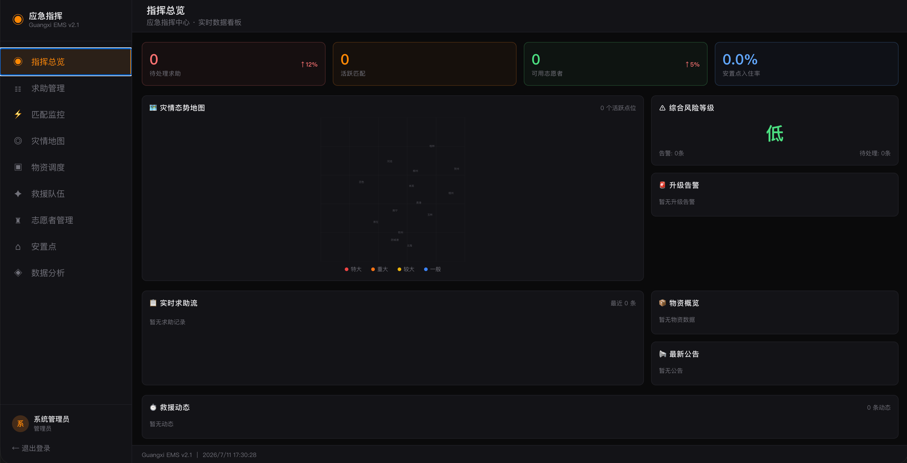
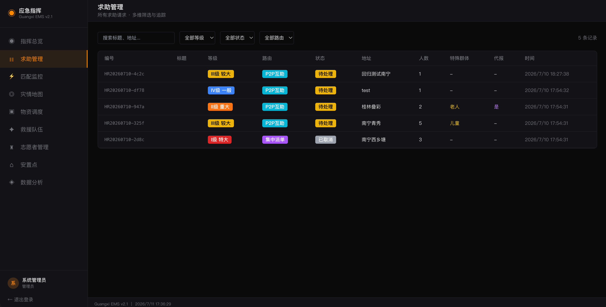
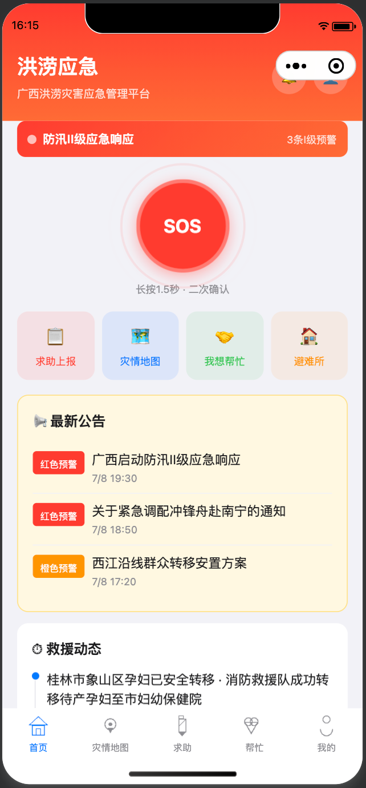
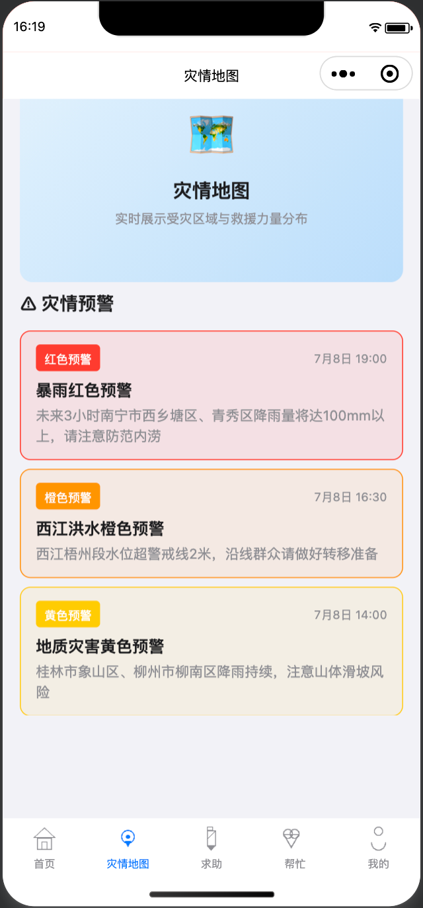
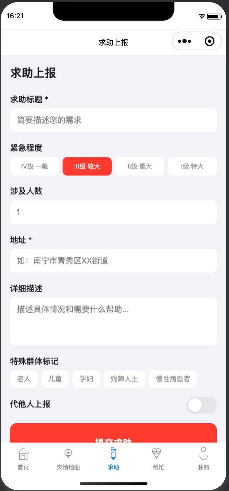
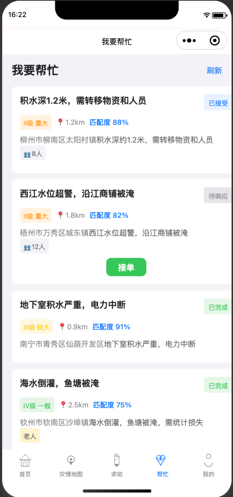
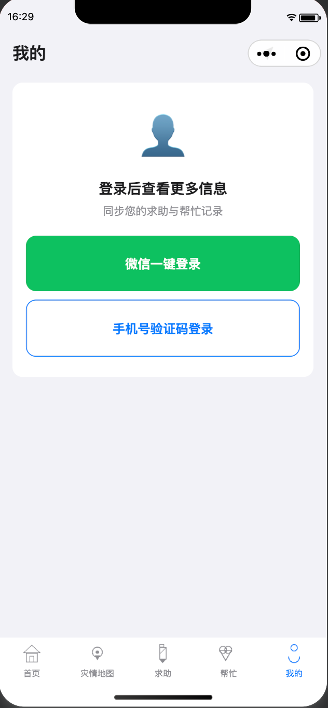
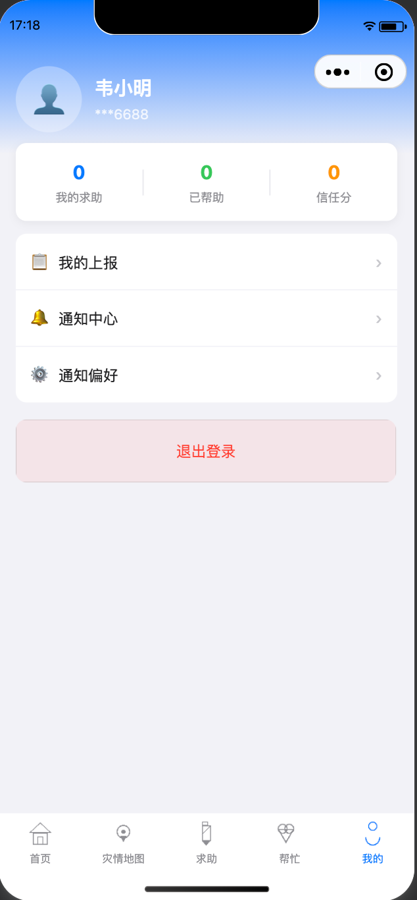

# 🆘 EmergencyMSystem 应急协同平台 — 前端

> **广西洪涝灾害应急管理多端协同平台**  
> Next.js 15 · TypeScript · Tailwind CSS  
> 微信小程序风格群众端 + Bloomberg Terminal 风格指挥中心

---

## 🤝 献给灾区

**本项目无条件捐献给受灾地区及各级应急管理部门使用。**

- ✅ 完全开源，**无偿使用**
- ✅ 提供**免费技术部署支持**
- ✅ 双端适配：群众端（微信小程序风格）+ 指挥中心（PC 大屏）
- ✅ 即开即用：SOS 一键报警 + P2P 志愿者就近匹配

> 如有部署、定制或技术咨询需求，欢迎提交 Issue 或联系项目维护者。  
> **灾情不等人，技术无边界。**

---

## 📋 项目概览

一个面向洪涝灾害场景的应急协同系统前端，提供**群众端 + 指挥中心端**双端体验：

### Mobile 端（微信小程序风格）

| 功能 | 说明 |
|------|------|
| 🆘 SOS 一键报警 | 长按触发 → 3 秒倒计时 → 确认创建紧急求助 |
| 📝 求助上报 | 位置/描述/人数/需求/物资 → 支持代报 & 特殊群体标记 |
| 🗺️ 灾情地图 | 查看附近求助点、避难所位置 |
| 🤝 我要帮忙 | 志愿者浏览附近可接任务、实时接单 |
| 🔔 通知中心 | 微信服务通知 + 站内提醒列表 |
| 🆔 个人中心 | 微信登录 / 游客登录 / 历史记录 |

### PC 端（指挥中心）

| 视图 | 说明 |
|------|------|
| 📊 指挥总览 | KPI 卡片（总求助/活跃匹配/志愿者数/空余安置位） |
| 📋 求助管理 | 列表 + 筛选（紧急度/状态/搜索） + 详情弹窗 |
| 🔍 匹配监控 | 活跃匹配卡 + 即将超时标记 + 失联告警 |
| 🗺️ 灾情地图 | SVG 地图 + 求助标记 + 资源分布 |
| 📦 物资调度 | 分类卡片 + 库存列表 + 批次状态（运送/到达/分发） |
| 🚁 救援队伍 | 队伍列表 + 人员 + 装备 + 位置 |
| 👥 志愿者管理 | 列表 + 技能标签 + Tier 等级 |
| 🏠 安置点管理 | 表格 + 容量/入住率 + 状态标签 |
| 📈 数据分析 | 求助趋势 / 区域分布 / 响应效率图表 |

---

## 🚀 快速开始

### 前置条件

- Node.js 18+
- npm

### 配置

```bash
# 安装依赖
npm install

# 可选：配置 API 地址（默认：环境变量）
# NEXT_PUBLIC_API_BASE=http://localhost:8080/api/v1
```

### 启动

```bash
# 开发模式
npm run dev
# → Mobile:  http://localhost:3000/m
# → PC:      http://localhost:3000/pc

# 生产构建
npm run build
npm start
```

---

## 🏗 项目结构

```
src/frontend/
├── src/
│   ├── app/                          # Next.js App Router 页面
│   │   ├── layout.tsx                # 全局布局 + AuthProvider
│   │   ├── page.tsx                  # 入口（UA 判断跳转 PC/M）
│   │   ├── pc/page.tsx               # PC 指挥中心（9视图 SPA）
│   │   └── m/page.tsx                # Mobile 群众端（5 Tab SPA）
│   │
│   ├── api/                          # API 请求层（Axios 封装）
│   │   ├── client.ts                 # 底层：JWT 自动注入 + 401 拦截
│   │   ├── auth.ts                   # 登录/注册/用户信息
│   │   ├── help-requests.ts          # 求助 CRUD
│   │   ├── matches.ts                # 匹配 + GPS 追踪
│   │   ├── volunteers.ts             # 志愿者/注册
│   │   ├── sos.ts                    # SOS 触发/确认
│   │   ├── notifications.ts          # 通知订阅/列表
│   │   ├── dashboard.ts             # 指挥中心数据
│   │   ├── alerts.ts                 # 灾情预警
│   │   ├── reviews.ts                # 评价
│   │   ├── calls.ts                  # 通话
│   │   └── index.ts                  # 统一导出
│   │
│   ├── components/
│   │   ├── shared/
│   │   │   ├── LoadingSpinner.tsx     # 加载 / 空状态
│   │   │   └── StatusBadge.tsx        # 状态标签（10+ 映射）
│   │   │
│   │   ├── mobile/                   # 群众端组件
│   │   │   ├── MobileLayout.tsx       # 布局 + 底部 TabBar
│   │   │   ├── TabBar.tsx            # 5 Tab 导航
│   │   │   ├── SOSButton.tsx         # SOS 长按 3 秒防误触
│   │   │   ├── MobileHomeView.tsx    # 首页：灾情 + 快捷入口
│   │   │   ├── MobileMapView.tsx     # 地图：求助 + 避难所
│   │   │   ├── MobileReportView.tsx   # 上报：含代报 + 特殊群体
│   │   │   ├── MobileHelpView.tsx     # 帮忙：附近任务列表
│   │   │   ├── MobileMyReportsView.tsx# 上报记录
│   │   │   ├── MobileSheltersView.tsx # 避难所列表
│   │   │   ├── MobileNotificationsView.tsx# 通知中心
│   │   │   └── MobileProfileView.tsx  # 个人中心 / 登录
│   │   │
│   │   └── pc/                       # 指挥中心组件
│   │       ├── PCLayout.tsx           # 布局：Sidebar + Header
│   │       ├── PCLoginView.tsx        # 登录页
│   │       ├── Sidebar.tsx           # 9 项导航菜单
│   │       ├── Header.tsx            # 顶部：标题 + 搜索 + 用户
│   │       ├── DashboardView.tsx      # 指挥总览 KPI
│   │       ├── HelpRequestsView.tsx   # 求助管理
│   │       ├── MatchMonitorView.tsx   # 匹配监控
│   │       ├── DisasterMapView.tsx    # 灾情地图
│   │       ├── ResourcesView.tsx      # 物资调度
│   │       ├── RescueTeamsView.tsx    # 救援队伍
│   │       ├── VolunteersView.tsx     # 志愿者管理
│   │       ├── SheltersView.tsx       # 安置点
│   │       └── AnalyticsView.tsx      # 数据分析
│   │
│   ├── contexts/
│   │   └── AuthContext.tsx           # 认证状态管理 + 自动刷新
│   ├── hooks/
│   │   └── useWebSocket.ts           # WebSocket 实时消息
│   ├── types/
│   │   ├── models.ts                 # 数据模型
│   │   ├── api.ts                    # API 通用类型
│   │   └── index.ts
│   └── lib/
│       └── constants.ts              # 20+ 枚举 -> 中文/颜色映射
│
├── tailwind.config.ts                # 设计系统令牌
├── next.config.mjs
├── tsconfig.json
├── package.json
└── FRONTEND_GUIDE.md                 # 开发指南
```

---

## 🎨 设计系统

### PC 端（暗色 Bloomberg Terminal 风格）

```
背景  → #0A0A0C      终端暗色
卡片  → #131316      深灰卡片
边框  → #1E1E24      细微分割
文字  → #E4E4E7      高对比白
强调  → #FF8800      应急橙
警告  → #EF4444      危险红
成功  → #10B981      完成绿
```

### Mobile 端（浅色 iOS 风格）

```
背景  → #F2F2F7      iOS 系统灰
卡片  → #FFFFFF      纯白卡片
文字  → #1C1C1E      深色文字
弱文  → #8E8E93      次要信息
红色  → #FF3B30      iOS 警示红
橙色  → #FF8800      应急主题色
```

---

## 🔌 API 对接

所有 API 请求通过 `src/api/` 统一的 Axios 封装，自动注入 JWT 并处理 401 跳转：

```typescript
import { helpRequestApi, matchApi, sosApi } from '@/api';

// 创建求助
const res = await helpRequestApi.create({
  area_code: '450100',
  address: '南宁西乡塘',
  content: '3人被困，急需转移',
  urgency: 'critical',
  people_count: 3,
  needs: [{ need_name: '船只', quantity: 1 }],
  vulnerable_groups: ['elderly', 'child'],
});

// 触发 SOS
await sosApi.trigger({
  lat: 22.84, lng: 108.32,
  location_source: 'gps',
});

// 接受匹配
await matchApi.accept('M001', { eta_min: 15 });
```

**配套后端：** https://github.com/xf20054658/EmergencyMSystem-be

---

## PC 端登录效果图

<div align="center">

**指挥总览**



**求助管理**



</div>

## Mobile 端登录效果图

<div align="center">

**首页**



**灾情地图**



**求助**



**帮忙**



**我的**





</div>

---

## 📄 许可

本项目**无条件捐献给灾害应急领域**。任何组织和个人均可自由使用、修改和分发。

- 用于灾害应急救援的：✅ **无偿使用**
- 用于商业目的：✅ **免费，欢迎联系开发者**
- 用于学习研究：✅ **欢迎 Fork 和 PR**

**灾情不等人，技术无边界。** 🌊

---

---

## 🙋 加入我们

**用技术为社会贡献一份力量。**

本项目欢迎所有技术人员参与维护：

- 🛠️ **代码贡献** — Fork → 改代码 → PR，前端/后端/全栈均可
- 🎨 **UI/UX 改进** — 优化移动端体验、大屏数据可视化
- 🌧️ **灾情数据对接** — 接入气象/水文实时数据、卫星遥感图
- 📱 **小程序适配** — 微信小程序原生能力优化（定位/推送/蓝牙 Mesh）
- 📖 **文档与测试** — 完善测试用例、部署文档、用户体验手册

> 一个人的代码，可能救一座城。欢迎提 PR 或 Issue！

## 📢 我们需要您推荐

- 🏛️ **有政府/应急管理部门资源的朋****请将本项目推荐给相关负责人员**
  - 应急管理厅/局、水利局、气象局
  - 消防救援队伍、红十字会、民间救援组织
  - 街道办事处、乡镇政府等基层单位
- 🏪 **有企业资源的朋****可协助对接通信运营商（AXB 隐私号）、地图服务（高德/百度）、短信通道等**
- 📱 **微信小程序认证加速**
  - 本项目的微信小程序**急需完成主体认证和服务类目审核**
  - 如有微信官方渠道或认证加速资源，请与我们联系
  - 其他合规认证如：ICP 备案、等保测评、数据安全评估等也在推进中

**您的每一次转发和推荐，都在为受灾群众争取救援时间。**

---

> **项目维护者：** 见山架构师  
> **前端仓库：** https://github.com/xf20054658/EmergencyMSystem-fe  
> **后端仓库：** https://github.com/xf20054658/EmergencyMSystem-be  
> **如有应急部署需求，请直接提交 Issue，我们会在 24 小时内响应。**
